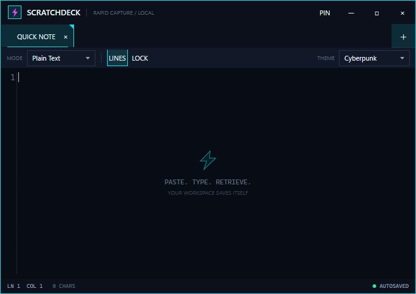

# Scratchdeck

Scratchdeck is a compact, native Windows scratchpad for notes, commands, IDs, code snippets, and quick sketches. Every tab is a hybrid document with independent Text and Scratch surfaces, automatic local persistence, optional per-tab DPAPI protection, persistent line wrapping, a custom dark WPF shell, and independently selectable app and code themes.



## Requirements

- Windows 10 or Windows 11
- [.NET 10 SDK](https://dotnet.microsoft.com/download/dotnet/10.0) for building
- Visual Studio 2026 with the **.NET desktop development** workload is optional

No installer is required. The only runtime NuGet dependency is AvalonEdit.

## Build and run

From the repository root:

```powershell
dotnet restore Scratchdeck.sln
dotnet build Scratchdeck.sln -c Release
dotnet run --project src/Scratchdeck/Scratchdeck.csproj -c Release
```

Run the tests with:

```powershell
dotnet test Scratchdeck.sln -c Release
```

For a framework-dependent publish that can later be packaged in MSIX:

```powershell
dotnet publish src/Scratchdeck/Scratchdeck.csproj -c Release -r win-x64 --self-contained false -o publish/win-x64
```

## How it works

The solution is deliberately small:

- `Models/` contains the observable tab model, theme catalog, window placement, and workspace state.
- `Services/WorkspacePersistenceService.cs` maps the live model to a disk DTO, encrypts protected content, performs atomic replacement, rotates one backup, and recovers malformed workspaces.
- `Services/DpapiProtectionService.cs` uses Windows DPAPI with `CurrentUser` scope. Protected text can only be decrypted by the same Windows user profile.
- `Services/SingleInstanceService.cs` uses a per-session mutex and named pipe. A second launch tells the existing window to restore and activate.
- `Services/SyntaxHighlightingService.cs` builds lightweight AvalonEdit definitions from the active theme palette, validates them against loaded content, and falls back to plain text if a definition is unsafe.
- `Services/InkStrokeSerializationService.cs` stores native WPF ink strokes as compressed, Base64-encoded ISF and safely recovers malformed drawing payloads as an empty canvas.
- `Services/ThemeService.cs` scans, validates, saves, and applies the JSON theme catalog. Its hard-coded Cyberpunk definitions keep the app usable if the catalog is missing or invalid.
- `Themes/` supplies the static WPF style system and startup fallback resources; runtime colors are layered in from the catalog.
- `MainWindow.xaml` and its focused code-behind own the view interactions: hybrid text/drawing tabs, brush controls, drag reordering, inline rename, search, theme editing, window chrome, and the 400 ms autosave debounce.

Workspace data is stored at:

```text
%LOCALAPPDATA%\Scratchdeck\workspace.json
```

The previous valid workspace is kept as `workspace.backup.json`, and recoverable I/O or parse errors are logged under `%LOCALAPPDATA%\Scratchdeck\logs\`.

Important: normal tabs store text directly and drawings as Base64 ink data in `workspace.json`. Turn on **LOCK** for a tab to store both payloads as Windows DPAPI ciphertext. This protects data at rest for other Windows users, but it is not a password vault and does not defend against software running as the same signed-in user.

## Keyboard shortcuts

| Shortcut | Action |
| --- | --- |
| `Ctrl+T` | Create a tab |
| `Ctrl+W` | Close the active tab |
| `Ctrl+Tab` | Select the next tab |
| `Ctrl+Shift+Tab` | Select the previous tab |
| `Ctrl+F` | Open search for the active tab |
| `Enter` / `Shift+Enter` | Next / previous search match |
| `F3` / `Shift+F3` | Next / previous search match |
| `Escape` | Close search or cancel a tab rename |
| `Ctrl+Shift+P` | Toggle always-on-top |
| `Ctrl+Z` | Undo text normally, or remove the most recent stroke in Scratch mode |
| `Ctrl+Y`, `Ctrl+X`, `Ctrl+C`, `Ctrl+V`, `Ctrl+A` | Standard AvalonEdit commands in Text mode |

Double-click a tab title to rename it. Drag a tab to reorder it. Use **WRAP** beside **PIN** to keep long lines inside the editor; the setting persists for the workspace. Right-click in the editor for cursor-aware Cut, Copy, Paste, and Select All commands. Closing the application never asks for confirmation; closing a tab only asks when that tab contains content.

## Hybrid Text and Scratch tabs

Every tab contains two separate payloads. **TEXT** shows the existing AvalonEdit document, while **SCRATCH** opens a native WPF ink canvas; switching surfaces never draws over or alters the text. The last surface, brush size, selected color, and strokes are restored per tab.

Scratch mode provides brush-size presets and a color button that opens a fixed 5×5 palette. The first ten slots contain common colors and the remaining slots start white for customization. Select a slot, enter a `#RRGGBB` or `#AARRGGBB` value, and choose **ADD** to replace that slot. Custom palette colors persist with the workspace. The status bar changes to show the current `Ctrl+Z` undo hint while drawing.

## App and code themes

The **APP** selector controls window chrome, surfaces, labels, controls, status colors, and the top-to-bottom outer-edge gradient. The **CODE** selector independently controls the editor background, foreground, selection, caret, line numbers, and syntax colors. The built-in choices are Cyberpunk (default), Amber Terminal, Matrix, and Nord Dark.

Use **EDIT** to open the theme panel. Existing themes can be customized in place, while **NEW** starts a copy of the active theme under a new title. App and code themes each have an independent font family and size. App font sizes accept 8–16 pt and code font sizes accept 8–32 pt.

The fixed footer keeps **Save** and **Cancel** available while the color lists scroll. Save validates and writes both edited theme halves in one catalog operation, then applies them together. Cancel, Escape, the panel ×, and clicking the shaded area discard unsaved editor changes. Color values accept `#RRGGBB` or `#AARRGGBB`; invalid values are marked before saving.

Themes are loaded at startup from:

```text
%LOCALAPPDATA%\Scratchdeck\themes.json
```

The catalog keeps app and code definitions separate. A shortened example is:

```json
{
  "schemaVersion": 2,
  "appThemes": [
    {
      "id": "cyberpunk",
      "title": "Cyberpunk",
      "fontFamily": "Segoe UI Variable Text, Segoe UI",
      "fontSize": 11,
      "colors": {
        "background": "#060910",
        "surface": "#0A1019",
        "outerEdgeTop": "#19D9F0",
        "outerEdgeBottom": "#FFC247",
        "primaryAccent": "#19D9F0",
        "secondaryAccent": "#FFC247"
      }
    }
  ],
  "codeThemes": [
    {
      "id": "cyberpunk-code",
      "title": "Cyberpunk",
      "fontFamily": "Cascadia Mono, Consolas",
      "fontSize": 13.5,
      "colors": {
        "background": "#070C14",
        "foreground": "#E4EBF0",
        "keyword": "#50C9FF",
        "string": "#E2D28A"
      }
    }
  ]
}
```

Scratchdeck writes the complete set of color fields when saving. Updates use an atomic temporary file and keep the previous valid catalog as `themes.backup.json`. If neither catalog can be loaded, the hard-coded Cyberpunk catalog is used; on a normal first launch it is also written to `themes.json` for customization.

## Syntax modes

Each tab can use Plain Text, C++, C#, JSON, XML, HTML, PowerShell, Python, JavaScript, Markdown, SQL, Go, or INI highlighting. Text remains plain and is preserved exactly as entered. Unexpected mixed content is validated before a highlighter is activated, so a problematic definition degrades to stable plain-text editing rather than taking down the window.
