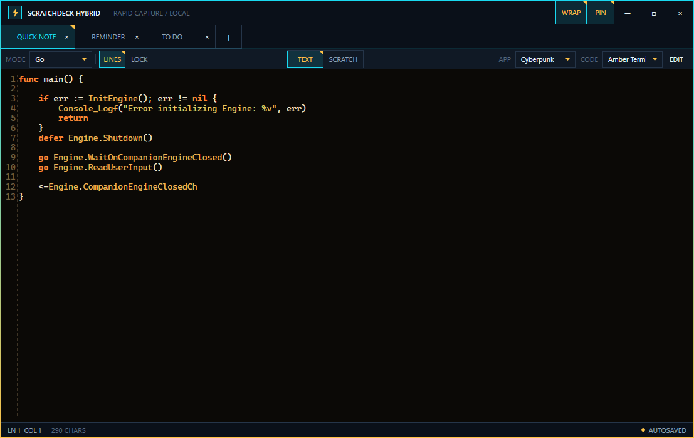
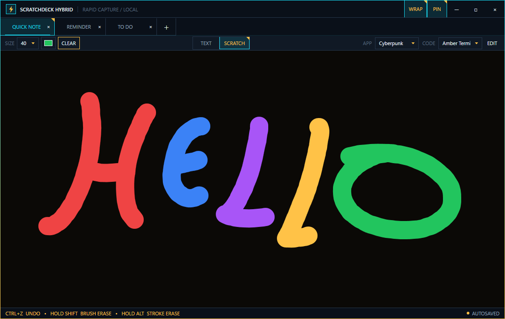

# Scratchdeck Hybrid

**Scratchdeck Hybrid** is a compact, local-first Windows scratchpad built around hybrid tabs. Every tab combines two independent surfaces: a syntax-aware text document and a freehand drawing canvas. Switch between **TEXT** and **SCRATCH** whenever you need to move from code or notes to a visual idea; both sides stay attached to the same tab and autosave together.

It is designed as a fast, practical desktop tool for snippets, commands, IDs, reminders, rough diagrams, and anything else that should be one click away.

## Screenshots

### Text mode



### Scratch mode



## Highlights

- **Hybrid tabs** — every tab keeps separate Text and Scratch content without one surface overwriting the other.
- **Code-friendly editor** — syntax highlighting, search, line numbers, persistent wrapping, and a cursor-aware Cut/Copy/Paste context menu.
- **Native scratch canvas** — mouse and stylus drawing with WPF ink, brush-size presets, drawing undo, reversible board clearing, and a 5×5 color palette.
- **Quick erase controls** — hold `Shift` for brush erasing or hold `Alt` to remove complete strokes.
- **Independent app and code themes** — change the shell and editor separately, including their font family and font size.
- **Custom themes** — create and edit themes inside the app; the catalog is stored as readable JSON.
- **Desktop utility features** — always-on-top, draggable and renameable tabs, window-position restoration, and single-instance activation.
- **Local persistence** — workspace content and settings autosave locally, while saved theme changes use their own recovery backup.
- **Optional tab protection** — **LOCK** protects both sides of a tab with Windows DPAPI for the current Windows user.

## Hybrid tabs

Each tab owns two payloads:

- **TEXT** is an AvalonEdit document for notes and code.
- **SCRATCH** is a WPF InkCanvas for freehand drawing.

Changing surfaces only changes what is visible. The text, strokes, selected surface, brush size, brush color, syntax mode, line-number setting, and protection state are restored with the tab.

Tabs can be created, closed, renamed by double-clicking, and reordered by dragging. The `+` button stays beside the final tab, while `Ctrl+T`, `Ctrl+W`, and `Ctrl+Tab` provide quick keyboard navigation.

## Text mode

Text mode supports Plain Text, C++, C#, JSON, XML, HTML, PowerShell, Python, JavaScript, Markdown, SQL, Go, and INI highlighting. Highlighting is applied defensively, so unexpected mixed content falls back safely instead of destabilizing the editor.

The editor includes:

- Find with next and previous match navigation
- Optional line numbers
- Persistent automatic wrapping
- Dark, compact scrollbars
- Standard undo, redo, cut, copy, paste, and select-all commands
- A cursor-aware Cut, Copy, Paste, and Select All context menu
- Independent code theme, font family, and font size

## Scratch mode

Scratch mode provides a compact drawing toolbar with brush-size presets and a fixed 5×5 palette. Ten common colors are available immediately; the remaining slots can be replaced with custom `#RRGGBB` or `#AARRGGBB` values.

- Draw normally with the selected size and color.
- Hold `Shift` for a temporary circular brush eraser.
- Hold `Alt` for a temporary whole-stroke eraser.
- Press `Ctrl+Z` to undo the most recent draw, erase pass, or clear action.
- Use **CLEAR** to empty the board as a single reversible action.

The status bar changes with the active drawing mode so the relevant shortcuts remain visible.

## Themes

The **APP** theme controls the window chrome, surfaces, control states, status colors, and top-to-bottom outer-edge gradient. The **CODE** theme independently controls the editor background, foreground, selection, caret, line numbers, and syntax colors.

Built-in themes include:

- Cyberpunk
- Amber Terminal
- Matrix
- Nord Dark

Open **EDIT** to customize an existing theme or create a new one. App and code themes have separate titles, palettes, font families, and font sizes. **Save** applies both edited halves together; **Cancel** discards unsaved edits.

Themes are loaded from:

```text
%LOCALAPPDATA%\Scratchdeck\themes.json
```

If no valid catalog can be loaded, the built-in themes keep the application usable. A missing catalog is recreated automatically.

## Requirements

### Running a published build

- Windows 10 or Windows 11
- [.NET 10 Desktop Runtime](https://dotnet.microsoft.com/download/dotnet/10.0) for the framework-dependent build

### Building from source

- Windows 10 or Windows 11
- [.NET 10 SDK](https://dotnet.microsoft.com/download/dotnet/10.0)
- Internet access for the initial NuGet package restore

The .NET 10 SDK is the complete minimum setup for command-line builds. Visual Studio is not required. For integrated IDE build, debugging, and XAML tooling, use Visual Studio 2026 with the [**.NET desktop development** workload](https://learn.microsoft.com/visualstudio/install/workload-component-id-vs-enterprise). Visual Studio 2022 can still be used as an editor alongside the .NET 10 `dotnet` CLI.

## Clone, build, and run

The quickest path puts the complete runnable application in one obvious `Build` folder:

```powershell
git clone https://github.com/Kaidoom/ScratchDeckHybrid.git
cd ScratchDeckHybrid
dotnet publish .\src\Scratchdeck\Scratchdeck.csproj -c Release -r win-x64 --self-contained false -o .\Build\win-x64
& ".\Build\win-x64\Scratchdeck Hybrid.exe"
```

`dotnet publish` restores the NuGet packages, builds the application, and writes the complete framework-dependent x64 build to:

```text
Build\win-x64\
```

.NET may also create ignored `bin` and `obj` working folders beneath the projects while compiling. Those are normal development artifacts; `Build\win-x64` is the folder to run or package.

The machine running that published build needs the .NET 10 Desktop Runtime. A machine with the .NET 10 SDK already has the required runtime.

## Contributor commands

Compile the complete solution, including the test project:

```powershell
dotnet build Scratchdeck.sln -c Release
```

This follows the standard .NET development layout and writes each project's output beneath its own `bin\Release` directory.

Run the automated tests with:

```powershell
dotnet test Scratchdeck.sln -c Release
```

Run directly from the source tree during development with:

```powershell
dotnet run --project .\src\Scratchdeck\Scratchdeck.csproj -c Release
```

## Keyboard shortcuts

| Shortcut | Action |
| --- | --- |
| `Ctrl+T` | Create a tab |
| `Ctrl+W` | Close the active tab |
| `Ctrl+Tab` | Select the next tab |
| `Ctrl+Shift+Tab` | Select the previous tab |
| `Ctrl+F` | Open search in Text mode |
| `Enter` / `Shift+Enter` | Select the next / previous search match |
| `F3` / `Shift+F3` | Select the next / previous search match |
| `Escape` | Close search, close a popup, or cancel a rename |
| `Ctrl+Shift+P` | Toggle always-on-top |
| `Ctrl+Z` | Undo text normally, or undo the latest Scratch action |
| Hold `Shift` | Temporarily brush-erase on the Scratch canvas |
| Hold `Alt` | Temporarily erase whole strokes on the Scratch canvas |
| `Ctrl+Y`, `Ctrl+X`, `Ctrl+C`, `Ctrl+V`, `Ctrl+A` | Standard Text-mode editing commands |

## Local data and protection

Scratchdeck Hybrid is local-first and does not require an account. Workspace data is stored under:

```text
%LOCALAPPDATA%\Scratchdeck\
```

The folder contains:

- `workspace.json` — tabs, text, drawings, palette, settings, and window state
- `workspace.backup.json` — the previous valid workspace
- `themes.json` — app and code theme definitions
- `themes.backup.json` — the previous valid theme catalog
- `logs\` — recoverable persistence and parsing errors

Normal tabs store their text and Base64-encoded WPF ink data directly in the workspace. Turning on **LOCK** stores both payloads as Windows DPAPI ciphertext using `CurrentUser` scope. Protected content can only be decrypted by the same Windows user profile. This protects data at rest from other Windows users, but it is not a password vault and does not defend against software already running as the signed-in user.

## Technology

Scratchdeck Hybrid is a .NET 10 WPF application. AvalonEdit provides the text editor, WPF InkCanvas provides native drawing data, and the rest of the application uses built-in Windows and .NET APIs for themes, JSON persistence, DPAPI protection, window placement, and single-instance activation.

## License

Scratchdeck is licensed under the MIT License. See [LICENSE](LICENSE).

Copyright (c) 2026 KaidoomDev.

Third-party components remain licensed under their respective licenses. See [THIRD-PARTY-NOTICES.md](THIRD-PARTY-NOTICES.md) for details.
